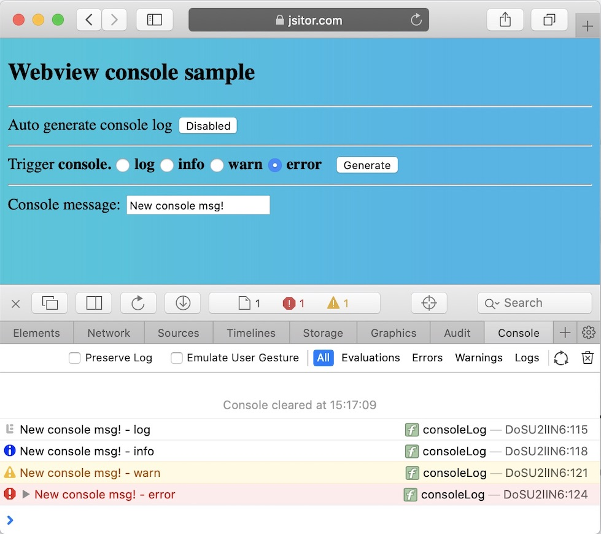
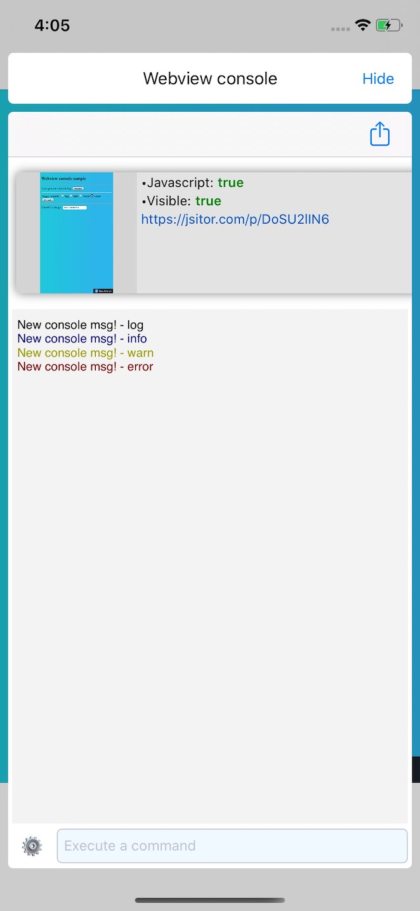

# WebviewConsole
WebviewConsole is a simple iOS tool written in Swift, which provides you the ability to get webviews console logs and execute javascript code, all directly within your iOS app. 

The WebviewConsole presents a separate UIWindow which gives you access to the webviews console and perform basic operation, such as executing javascript code.
By default the tool will **try** to auto-detect all the webviews currently loaded into the app (visible or not). You can also decide to disable the auto-detect feature and track 
the webviews manually based on your needs. Currently, the tool is able to show right away any console.log/info/warn/error printed by the webview in the console, in the same way as it would be for an ispected webview through Safari or Chrome

<table>
    <tr>
      <td>Sample console output on MacOS Safari console</td>
      <td>Sample console output into the WebviewConsole tool</td>
    </tr>
    <tr>
        <td></td>
        <td></td>
    </tr>

</table>

## Setup

Include the content of the folder `WebviewConsole` into your project. It contains the below files:
* `WebviewConsole.storyboard`
* `WebviewConsole.swift`
* `WebviewConsoleViewController.swift`
* `WebviewConsoleUtilities.swift`

## Usage

In order to use the WebviewConsole, you need to refer only to the singleton class `WebviewConsole`. It currently provides the following methods:
* `show()` : Shows the WebviewConsole window on the screen
* `hide()` : Hides the WebviewConsole window from the screen
* `trackWebview(_ webview:WKWebView)` : Adds the provided webview instance in the tracked webview list and attaches/updates the webview event

To use the component in runtime you just need to call `WebviewConsole.shared.show()` to show it, or `WebviewConsole.shared.hide()` in order to hide it

## Manually Track webiews

You can rely on the default auto-detect webview features provided by the tool and/or combine it with the method `trackWebview(_ webview:WKWebView)` in order to make sure that you don't miss a single log from the webview console.
For example, if your view controller implements the `WKNavigationDelegate`, then you can call it into the delegate method `webView(_ webView: WKWebView, didCommit navigation: WKNavigation!)` in order to attach the listeners as soon as the page starts loading and receiving content from the server. Below the usage:

```swift
func webView(_ webView: WKWebView, didCommit navigation: WKNavigation!) {
    WebviewConsole.shared.trackWebview(webView)
}
```

## Features

* Webviews Auto-detect : It tries to inspect the view hierachies in order to find all the `WKWebView` instances which could be tracked
* Command suggestion: As soon as you give the focus on the 'Execute a command' text field, it will show also a view on top of it, listing several basilar Javascript commands, and those gets filtered as long as you start typing. You can refer to `WebviewConsole.CommandSuggestionView` class for further information
* Search: By tapping on the 'gear' icon beside the command text field, a search textfield will be provided and will allow you to search and highlight all the matches across the currently displyed logs for the selected webview
* Clear logs for the current webview, for all the tracked webview, or clear the whole webview tracking, including the reload content of the selected webview

## Other information

The tool tracks the webviews using `NSHashTable<WKWebView>.weakObjects()` approach in order to avoid memory leaks. As soon as a webview gets deallocated, the reference within the WebviewConsole will reflect as well

The actual component behind is `WebviewConsoleViewController`. It provides basic configuration properties which you can change, like:
* `autoDetectWebviews`
* `clearWebviewsOnHide`
* `suggestCommandsOnEditing`
* `scrollToBottomOnLogAdd`

